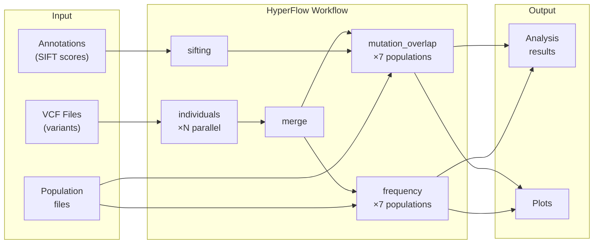
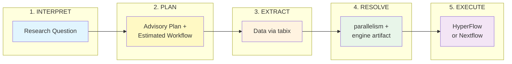

# 1000genome-workflow

The Pegasus 1000genome workflow for identifying mutational overlaps in 1000 Genomes Project data, with an agentic composer that turns a natural-language research question into an executed workflow.

The workflow runs on two engines, HyperFlow and Nextflow, from the same intent and the same analysis scripts. The composer's intent interpretation and its domain knowledge are shared; each engine contributes only a backend (`workflow-composer/src/workflow_composer/backends/`) and a pipeline definition under `engines/`.

## Overview

This workflow analyzes genetic variation data from the 1000 Genomes Project to identify mutational overlaps across populations. It processes VCF files for multiple chromosomes through a series of analysis steps including individual processing, sifting, mutation overlap detection, and frequency calculation.



## End-to-End Pipeline

This project implements the **workflow composer agent** which enables a 5-phase pipeline from natural language research questions to executed workflows.
Note that the composer provides plan for phases 3 and 5, but they need to be executed by workflow execution agents on the target system.



| Phase | Description |
|-------|-------------|
| **INTERPRET** | Parse natural language research question into structured intent |
| **PLAN** | Create advisory plan with estimated workflow for validation |
| **EXTRACT** | Acquire genomic data via tabix remote extraction |
| **RESOLVE** | Size parallelism from the measured data, then commit it in the form the engine binds: `workflow.json` for HyperFlow, a parameter vector for Nextflow |
| **EXECUTE** | Run the workflow on the selected engine with Docker workers |

See [workflow-composer/README.md](workflow-composer/README.md) for detailed phase documentation.

## Repository Structure

```
1000genome-workflow/
├── workflow-composer/      # Engine-neutral composer: intent, knowledge, backends
├── engines/
│   ├── hyperflow/harness/  # HyperFlow pipeline driver + Docker Compose
│   └── nextflow/           # Nextflow pipeline (main.nf) + its test data
├── gui/                    # Local dual-engine GUI
├── worker-base-image/      # Base image with the analysis scripts (both engines)
├── worker-image/           # HyperFlow worker image (adds the job executor)
├── workflow-generator/     # Original Pegasus DAG generation
├── data-container/         # Input data + workflow.json (~1.7GB image)
├── tests/equivalence/      # Cross-engine result comparison + reference bundles
├── scripts/                # Utility scripts
└── fargate/                # AWS Fargate-specific components (legacy)
```

## Docker Images

| Image | Description |
|-------|-------------|
| `hyperflowwms/1000genome-worker-base` | Base image with Python analysis scripts |
| `hyperflowwms/1000genome-worker` | HyperFlow worker with job-executor |
| `hyperflowwms/1000genome-generator` | Workflow DAG generator |
| `hyperflowwms/1000genome-mcp` | MCP server for AI integration |
| `hyperflowwms/1000genome-data` | Input data (VCF + annotations, ~1.7GB) |

## Input Data

The workflow requires input data (~1.7GB) including VCF files, annotation files, and population sample lists.

**Note:** Annotation files (~1.2GB) are not stored in the git repository due to size. Use one of the following methods:

### Option 1: Use the data image (recommended)

```bash
# Prepare input data in a local directory
docker run --rm -v $(pwd)/input-data:/mnt/data hyperflowwms/1000genome-data:1.0 sh /prepare_data.sh
```

### Option 2: Download annotation files manually

```bash
cd data-container
./download_annotations.sh    # Downloads ~1.2GB from 1000 Genomes FTP
make image                   # Build data image locally
```

See [data-container/README.md](data-container/README.md) for details.

## Building

```bash
# Build all images
make build-all

# Build individual images
make build-worker-base
make build-worker
make build-generator
make build-mcp
make build-data

# Push all images to Docker Hub
make push-all
```

## Generating Workflows

### Using workflow-composer (recommended)

The `workflow-composer` package generates HyperFlow workflows natively in Python:

```bash
# Install
pip install -e workflow-composer

# Generate workflow from data.csv
workflow-composer generate \
    --data-csv workflow-generator/data.csv \
    --populations-dir workflow-generator/data/populations \
    --parallelism medium \
    --output workflow.json
```

**Parallelism presets:**
| Preset | Jobs per chromosome | Use case |
|--------|---------------------|----------|
| small | 10 | Testing, small regions |
| medium | 50 | Standard analysis |
| large | 250 | Full genome |

See [workflow-composer/README.md](workflow-composer/README.md) for details.

### Using Docker (legacy)

```bash
make generate
```

Or manually:
```bash
cd workflow-generator
docker build -t hyperflowwms/1000genome-generator .
docker run --rm -v $(pwd)/../data:/output hyperflowwms/1000genome-generator \
    sh -c "cd /1000genome-workflow && ./generate_workflow.sh && cp workflow.json /output/"
```

## MCP Server

The MCP server enables AI-assisted workflow generation. See [workflow-composer/README.md](workflow-composer/README.md#mcp-server) for details.

Add to Claude Desktop configuration:
```json
{
  "mcpServers": {
    "1000genome": {
      "command": "docker",
      "args": ["run", "-i", "--rm", "hyperflowwms/1000genome-mcp:2.0"]
    }
  }
}
```

## Integration Tests

Run integration tests to validate the complete pipeline:

```bash
cd engines/hyperflow/harness

# Test with the micro dataset (fast, ~2-3 minutes)
./run-research-tests.sh -y micro

# Test with real 1000 Genomes data via tabix
./run-research-tests.sh --mock-llm -y brca1-gbr
```

See [engines/hyperflow/harness/README.md](engines/hyperflow/harness/README.md) for detailed documentation on the end-to-end workflow execution pipeline.

## License

This project is licensed under the Apache License 2.0 - see the [LICENSE](LICENSE) file for details.

## Acknowledgments

This project is a HyperFlow port of the [Pegasus 1000genome-workflow](https://github.com/pegasus-isi/1000genome-workflow), originally developed by the University of Southern California. The workflow generator and Pegasus DAX libraries are used under the Apache License 2.0.

## References

- [1000 Genomes Project](https://www.internationalgenome.org/)
- [HyperFlow Workflow Management System](https://github.com/hyperflow-wms/hyperflow)
- [Pegasus Workflow Management System](https://pegasus.isi.edu/)
