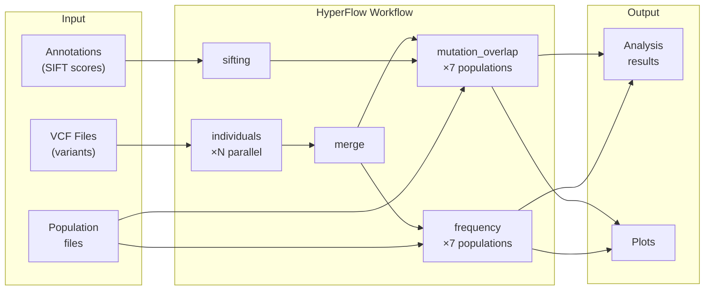
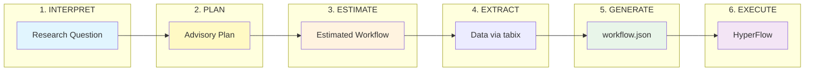

# 1000genome-workflow

HyperFlow port of the Pegasus 1000genome workflow for identifying mutational overlaps using data from the 1000 Genomes Project.

## Overview

This workflow analyzes genetic variation data from the 1000 Genomes Project to identify mutational overlaps across populations. It processes VCF files for multiple chromosomes through a series of analysis steps including individual processing, sifting, mutation overlap detection, and frequency calculation.



## End-to-End Pipeline

The workflow-composer enables a 6-phase pipeline from natural language research questions to executed workflows:



| Phase | Description |
|-------|-------------|
| **INTERPRET** | Parse natural language research question into structured intent |
| **PLAN** | Create advisory plan with data extraction commands and estimates |
| **ESTIMATE** | Generate preliminary workflow with estimated variant counts |
| **EXTRACT** | Download data via tabix remote extraction (only needed regions) |
| **GENERATE** | Create final workflow.json from actual data counts |
| **EXECUTE** | Run workflow with HyperFlow + Docker workers |

See [workflow-composer/README.md](workflow-composer/README.md) for detailed phase documentation.

## Repository Structure

```
1000genome-workflow/
├── workflow-composer/      # Native workflow generator + MCP server (recommended)
├── worker-base-image/      # Base Docker image with analysis scripts
├── worker-image/           # HyperFlow worker image (Kubernetes)
├── workflow-generator/     # Legacy DAG generation (Pegasus-based)
├── data-container/         # Input data + workflow.json (~1.7GB image)
├── tests/integration/      # Integration tests with Docker Compose
├── scripts/                # Utility scripts
└── fargate/                # AWS Fargate-specific components (legacy)
```

## Docker Images

| Image | Description |
|-------|-------------|
| `hyperflowwms/1000genome-worker-base` | Base image with Python analysis scripts |
| `hyperflowwms/1000genome-worker` | HyperFlow worker with job-executor |
| `hyperflowwms/1000genome-generator` | Workflow DAG generator |
| `hyperflowwms/1000genome-mcp` | MCP server for AI integration |
| `hyperflowwms/1000genome-data` | Input data (VCF + annotations, ~1.7GB) |

## Input Data

The workflow requires input data (~1.7GB) including VCF files, annotation files, and population sample lists.

**Note:** Annotation files (~1.2GB) are not stored in the git repository due to size. Use one of the following methods:

### Option 1: Use the data image (recommended)

```bash
# Prepare input data in a local directory
docker run --rm -v $(pwd)/input-data:/mnt/data hyperflowwms/1000genome-data:1.0 sh /prepare_data.sh
```

### Option 2: Download annotation files manually

```bash
cd data-container
./download_annotations.sh    # Downloads ~1.2GB from 1000 Genomes FTP
make image                   # Build data image locally
```

See [data-container/README.md](data-container/README.md) for details.

## Building

```bash
# Build all images
make build-all

# Build individual images
make build-worker-base
make build-worker
make build-generator
make build-mcp
make build-data

# Push all images to Docker Hub
make push-all
```

## Generating Workflows

### Using workflow-composer (recommended)

The `workflow-composer` package generates HyperFlow workflows natively in Python:

```bash
# Install
pip install -e workflow-composer

# Generate workflow from data.csv
workflow-composer generate \
    --data-csv workflow-generator/data.csv \
    --populations-dir workflow-generator/data/populations \
    --parallelism medium \
    --output workflow.json
```

**Parallelism presets:**
| Preset | Jobs per chromosome | Use case |
|--------|---------------------|----------|
| small | 10 | Testing, small regions |
| medium | 50 | Standard analysis |
| large | 250 | Full genome |

See [workflow-composer/README.md](workflow-composer/README.md) for details.

### Using Docker (legacy)

```bash
make generate
```

Or manually:
```bash
cd workflow-generator
docker build -t hyperflowwms/1000genome-generator .
docker run --rm -v $(pwd)/../data:/output hyperflowwms/1000genome-generator \
    sh -c "cd /1000genome-workflow && ./generate_workflow.sh && cp workflow.json /output/"
```

## MCP Server

The MCP server enables AI-assisted workflow generation. See [workflow-composer/README.md](workflow-composer/README.md#mcp-server) for details.

Add to Claude Desktop configuration:
```json
{
  "mcpServers": {
    "1000genome": {
      "command": "docker",
      "args": ["run", "-i", "--rm", "hyperflowwms/1000genome-mcp:2.0"]
    }
  }
}
```

## Integration Tests

Run integration tests to validate the complete pipeline:

```bash
cd tests/integration

# Test with micro dataset (fast, ~2-3 minutes)
./test-workflow-composer.sh --parallelism small --yes

# Test with real 1000 Genomes data via tabix
./test-hla-region.sh --quick --yes
```

See [tests/integration/README.md](tests/integration/README.md) for detailed documentation on the end-to-end workflow execution pipeline.

## License

This project is licensed under the Apache License 2.0 - see the [LICENSE](LICENSE) file for details.

## Acknowledgments

This project is a HyperFlow port of the [Pegasus 1000genome-workflow](https://github.com/pegasus-isi/1000genome-workflow), originally developed by the University of Southern California. The workflow generator and Pegasus DAX libraries are used under the Apache License 2.0.

## References

- [1000 Genomes Project](https://www.internationalgenome.org/)
- [HyperFlow Workflow Management System](https://github.com/hyperflow-wms/hyperflow)
- [Pegasus Workflow Management System](https://pegasus.isi.edu/)
