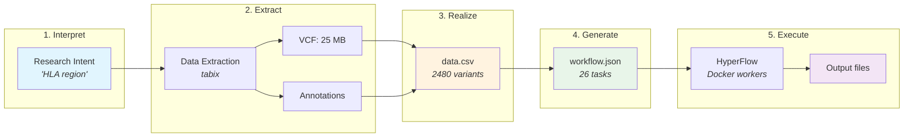
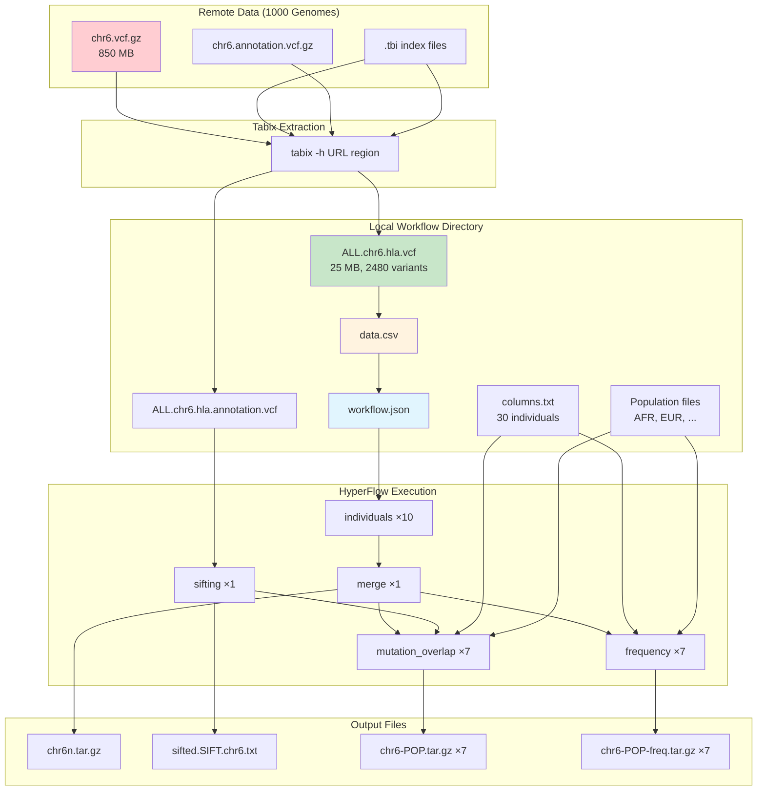

# Integration Tests

Integration tests for the 1000genome-workflow using Docker Compose.

## Prerequisites

- Docker and Docker Compose installed
- All workflow images built (`make build-all` from repository root)
- workflow-composer installed (`pip install -e workflow-composer`)

## Quick Start

```bash
# Run workflow-composer integration test (recommended)
./test-workflow-composer.sh --parallelism small --yes

# Or run the HLA region test with real data
./test-hla-region.sh --quick --yes
```

## Available Tests

### Workflow Composer Test (Recommended)

Tests the workflow-composer's ability to generate working HyperFlow workflows.

```bash
./test-workflow-composer.sh --parallelism small --yes
```

Parameters:
- Uses micro test data (10,000 variants, 30 individuals)
- Generates workflow via workflow-composer (not legacy daxgen.py)
- Verifies all expected outputs

### HLA Region Test (Real Data)

Tests with real 1000 Genomes data downloaded via tabix.

```bash
# Quick mode (~100kb region, faster)
./test-hla-region.sh --quick --yes

# Full HLA region (~5Mb, slower)
./test-hla-region.sh --yes
```

Parameters:
- Downloads real chromosome 6 HLA region data via tabix
- Trims to 30 individuals for faster testing (minimum required by mutation_overlap.py)
- Tests complete workflow with production data
- **26 total tasks** (10 individuals + 1 merge + 1 sifting + 7×2 analyses)

### Legacy Micro Workflow

```bash
./setup-micro-workflow.sh
./run-workflow.sh workflow-micro
```

Parameters:
- 1 chromosome (chr1)
- 10,000 rows (instead of 250,000)
- 5 parallel individuals jobs
- 30 individuals (minimum 26 required by mutation_overlap.py)
- **21 total jobs**, completes in ~2-3 minutes

### Legacy Tiny Workflow (Full data, single job)

```bash
./setup-tiny-workflow.sh
./run-workflow.sh workflow-tiny
```

Parameters:
- 1 chromosome (chr1)
- 250,000 rows (full data)
- 1 individuals job
- 2,504 individuals (all)
- **17 total jobs**, takes much longer (~hours)

## Configuration

### Max Parallelism

Control how many jobs run in parallel:

```bash
MAX_PARALLELISM=30 ./run-workflow.sh workflow-micro
```

Default is 20.

## Output Files

After successful execution, the workflow directory contains:

| File | Description |
|------|-------------|
| `chr1n-*.tar.gz` | Individual job outputs (variant data per row range) |
| `chr1n.tar.gz` | Merged individuals output |
| `sifted.SIFT.chr1.txt` | Filtered variants with SIFT scores |
| `chr1-{POP}.tar.gz` | Mutation overlap analysis per population |
| `chr1-{POP}-freq.tar.gz` | Frequency analysis per population |

## Cleanup

```bash
# Remove workflow directory
rm -rf workflow-micro

# Remove Docker resources
docker-compose down
```

---

## For Agent Developers: End-to-End Workflow Execution

This section documents the complete pipeline from research intent to executed workflow.
The HLA test (`test-hla-region.sh`) demonstrates this flow and serves as a reference
implementation for execution agents.

### Pipeline Overview



**Detailed data flow:**



### Step 1: Interpret Research Intent

An execution agent receives a natural language request like:
- "Analyze genetic variation in the HLA region"
- "Compare EUR vs AFR populations in BRCA1"

The agent must resolve this to concrete parameters:

| Intent Component | Example | Source |
|-----------------|---------|--------|
| Region name | "HLA" | User prompt |
| Chromosome | 6 | `KNOWN_REGIONS` in `data_resolver.py` |
| Start position | 28,477,797 | `KNOWN_REGIONS` |
| End position | 33,448,354 | `KNOWN_REGIONS` |
| Populations | AFR, ALL, AMR, EAS, EUR, GBR, SAS | Default or user-specified |

### Step 2: Data Extraction (Tabix)

Rather than downloading entire chromosomes (850+ MB each), use **tabix** for random
access extraction of specific regions:

```bash
# Extract only the HLA region from the remote VCF (requires SSL-enabled tabix)
tabix -h \
  "https://ftp.1000genomes.ebi.ac.uk/.../ALL.chr6...vcf.gz" \
  6:28477797-33448354 \
  > ALL.chr6.hla.vcf
```

**Key points:**
- Tabix uses the `.tbi` index file to seek directly to the region
- Downloads ~25 MB instead of 850 MB for full chromosome
- Requires a container with SSL support (e.g., `broadinstitute/gatk:4.4.0.0`)
- Also extract matching annotation file for sifting step

**Required files after extraction:**
```
workflow-dir/
├── ALL.chr6.hla.vcf           # Extracted VCF (variants)
├── ALL.chr6.hla.annotation.vcf # Extracted annotations (for sifting)
├── columns.txt                 # Sample metadata (from data container)
├── AFR, ALL, AMR, EAS, EUR, GBR, SAS  # Population files
```

### Step 3: Realize - Create data.csv

The **realization** step connects abstract plans to concrete files by counting
actual data and creating `data.csv`:

```bash
# Count variants (excluding header lines)
VARIANT_COUNT=$(grep -v '^#' ALL.chr6.hla.vcf | wc -l)
# Result: 2480

# Create data.csv mapping
echo "ALL.chr6.hla.vcf,${VARIANT_COUNT},ALL.chr6.hla.annotation.vcf" > data.csv
```

**data.csv format:**
```
<vcf_file>,<row_count>,<annotation_file>
ALL.chr6.hla.vcf,2480,ALL.chr6.hla.annotation.vcf
```

For multiple chromosomes, add one line per chromosome:
```
ALL.chr1.vcf,250000,ALL.chr1.annotation.vcf
ALL.chr2.vcf,240000,ALL.chr2.annotation.vcf
```

### Step 4: Generate Workflow

Use workflow-composer to generate the HyperFlow workflow JSON:

```bash
python3 -m workflow_composer.cli generate \
    --data-csv data.csv \
    --populations-dir /path/to/populations/ \
    --parallelism small \
    --output workflow.json
```

**Parallelism presets:**
| Preset | ind_jobs | Use case |
|--------|----------|----------|
| small | 10 | Small regions, testing |
| medium | 50 | Standard analysis |
| large | 250 | Full genome |

**Generated workflow structure:**
```
workflow.json
├── processes[]
│   ├── individuals (×10)     # Parallel variant processing
│   ├── individuals_merge (×1) # Combine results
│   ├── sifting (×1)          # Filter by SIFT scores
│   ├── mutation_overlap (×7)  # Per-population analysis
│   └── frequency (×7)         # Per-population frequency
└── signals[]                  # Data dependencies
```

**Task count formula:**
```
total_tasks = C × (ind_jobs + 2 + 2P)
where:
  C = number of chromosomes
  ind_jobs = parallelism preset (10/50/250)
  P = number of populations (default 7)
```

### Step 5: Execute Workflow

Run the workflow using Docker Compose with HyperFlow:

```bash
export WORKFLOW_DIR=/path/to/workflow-dir
export USER_ID=$(id -u)
export USER_GID=$(id -g)
export MAX_PARALLELISM=20

docker-compose up
```

**Execution environment:**
- **Redis**: Job queue for HyperFlow
- **HyperFlow**: Workflow engine that schedules tasks
- **Worker containers**: Execute individual tasks (individuals.py, sifting.py, etc.)

### Step 6: Verify Outputs

Expected outputs after successful execution:

| Output | Description |
|--------|-------------|
| `chr{N}n-*.tar.gz` | Per-task individual outputs |
| `chr{N}n.tar.gz` | Merged individuals result |
| `sifted.SIFT.chr{N}.txt` | Sifting output |
| `chr{N}-{POP}.tar.gz` | Mutation overlap per population |
| `chr{N}-{POP}-freq.tar.gz` | Frequency analysis per population |

### Example: Complete Agent Flow

```python
# Pseudocode for an execution agent

def execute_genomic_analysis(prompt: str):
    # 1. Interpret intent
    intent = interpret_research_question(prompt)  # LLM call
    region = resolve_region(intent.region_name)   # HLA → chr6:28477797-33448354

    # 2. Extract data
    vcf_file = tabix_extract(
        url=get_vcf_url(region.chromosome),
        region=f"{region.chromosome}:{region.start}-{region.end}"
    )
    annotation_file = tabix_extract(
        url=get_annotation_url(region.chromosome),
        region=f"{region.chromosome}:{region.start}-{region.end}"
    )

    # 3. Realize - count and create data.csv
    variant_count = count_variants(vcf_file)
    create_data_csv(vcf_file, variant_count, annotation_file)

    # 4. Generate workflow
    workflow = generate_workflow(
        data_csv="data.csv",
        populations_dir="/data/populations",
        parallelism="small"
    )

    # 5. Execute
    run_hyperflow(workflow)

    # 6. Verify and return results
    return verify_outputs()
```

### Performance Considerations

| Factor | Impact | Mitigation |
|--------|--------|------------|
| Number of individuals | 80× slowdown with 2504 vs 30 | Trim columns.txt for testing |
| Region size | Linear with variant count | Use `--quick` for small subset |
| Parallelism | More tasks = more overhead | Match to data size |
| Network | Tabix extraction speed | Use regional data mirrors |

### Debugging Tips

1. **Workflow not starting?** Check that input signals have `"data": [{}]` attribute
2. **Tasks stuck?** Check Redis connection and worker container logs
3. **Missing outputs?** Verify all input files exist and are readable
4. **Wrong chromosome?** Chromosome is extracted from VCF filename pattern
