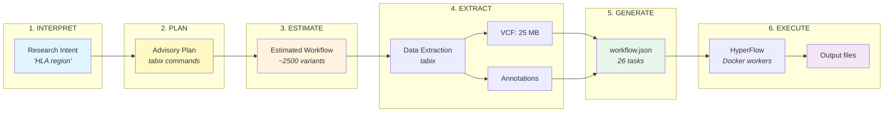
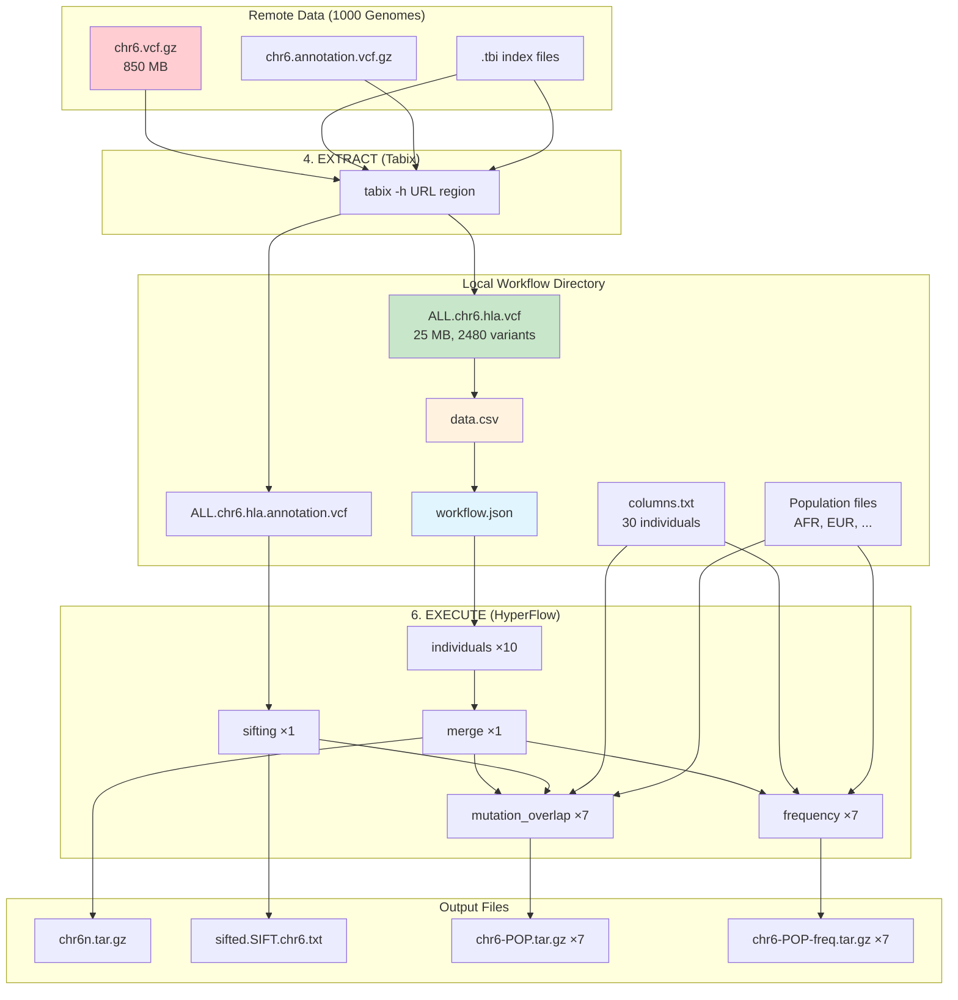

# Workflow Composer

Generate genomics workflow plans from natural language for the 1000 Genomes Project.

## Overview

The **workflow-composer** is an agent that transforms natural language research questions into executable workflow plans for scientific computing. It produces structured output suitable for human review and downstream execution agents.

**This component replaces the `mcp-server/` folder** and eliminates the external dependency on `daxgen.py + hflow-convert-dax`.

## Key Features

- **Dual-mode operation**: MCP server (chat) + CLI (standalone)
- **Native workflow generation**: Direct HyperFlow JSON output (no Pegasus dependency)
- **Human-in-the-loop**: Plans returned for review before execution
- **Structured contracts**: Pydantic models for validation and documentation
- **Format export**: HyperFlow and WfCommons formats supported

## Installation

```bash
# Basic installation
pip install -e .

# With MCP server support
pip install -e ".[mcp]"

# With LLM interpretation support
pip install -e ".[llm]"

# Full installation
pip install -e ".[all]"
```

## Usage

### Direct Workflow Generation (daxgen.py replacement)

```bash
# Generate HyperFlow workflow directly
g1kwf generate \
    --data-csv ../workflow-generator/data.csv \
    --populations-dir ../workflow-generator/data/populations \
    --ind-jobs 250 \
    -o workflow.json
```

### Natural Language Interface

```bash
# Generate workflow from research question (requires LLM deps)
g1kwf compose "Compare EUR vs AFR in HLA region"
```

### Structured Intent

```bash
# Generate from structured JSON
g1kwf plan '{"analysis_type": "population_comparison", "populations": ["EUR", "AFR"]}'
```

### List Available Options

```bash
# List known genomic regions
g1kwf regions

# List population codes
g1kwf populations
```

## MCP Server

The workflow-composer includes an MCP (Model Context Protocol) server for integration with Claude Desktop and other MCP-compatible clients.

### Running Locally

```bash
python -m workflow_composer.mcp_server
```

### Docker Image

Build and run as a Docker container:

```bash
cd workflow-composer
make image
docker run -i --rm hyperflowwms/1000genome-mcp:2.0
```

### Claude Desktop Integration

Add to Claude Desktop configuration (`~/.config/Claude/claude_desktop_config.json`):

```json
{
  "mcpServers": {
    "1000genome": {
      "command": "docker",
      "args": ["run", "-i", "--rm", "hyperflowwms/1000genome-mcp:2.0"]
    }
  }
}
```

### MCP Tools

| Tool | Description |
|------|-------------|
| `plan_workflow` | Generate advisory workflow plan from research parameters |
| `generate_workflow` | Generate actual HyperFlow workflow JSON from chromosome data |
| `estimate_variants` | Estimate variant count for a chromosome or genomic region |
| `list_known_regions` | List available genomic regions with coordinates |
| `list_populations` | List population codes with descriptions |

### MCP Resources (Skills)

The server provides skill documents as MCP resources:

| Resource | Description |
|----------|-------------|
| SKILL.md | Workflow planning guidelines |
| populations.md | Population codes and descriptions |
| genomic-regions.md | Known genomic regions |
| data-sources.md | Data source URLs (AWS, GCP, FTP) |
| research-contexts.md | Scientific context mapping |

## Task Count Formula

For **C** chromosomes, **P** populations, **J** ind_jobs per chromosome:

| Task Type | Count |
|-----------|-------|
| individuals | C × J |
| individuals_merge | C × 1 |
| sifting | C × 1 |
| mutation_overlap | C × P |
| frequency | C × P |
| **TOTAL** | **C × (J + 2 + 2P)** |

Example: C=10, P=7, J=250 → 10 × (250 + 2 + 14) = **2660 tasks**

## Architecture

```
workflow-composer/
├── src/workflow_composer/
│   ├── core/                  # Business logic
│   │   ├── generator.py       # ★ Native HyperFlow generation
│   │   ├── models.py          # Pydantic models
│   │   ├── planner.py         # Wraps generator + metadata
│   │   ├── data_resolver.py   # Data source selection
│   │   └── export.py          # Format converters
│   ├── interpretation/        # LLM layer (CLI mode)
│   │   ├── skill_loader.py    # Load skills as context
│   │   └── llm_interpreter.py # Research question → intent
│   ├── mcp_server.py          # MCP server interface
│   └── cli.py                 # CLI interface
├── skills/                    # Domain knowledge documents
├── tests/                     # Test suite
└── pyproject.toml
```

## Testing

```bash
# Run all tests
pytest tests/ -v

# Run specific test file
pytest tests/test_generator.py -v
```

## Known Differences from daxgen.py

The native generator produces **functionally equivalent** but not byte-identical output:

| Aspect | daxgen.py + hflow-convert-dax | Native Generator |
|--------|-------------------------------|------------------|
| File count | 2689 (one duplicate bug) | 2688 (correct) |
| Population order | Non-deterministic | Sorted alphabetically |

## Test Data vs Production Data

The workflow-composer generates two distinct outputs:

### 1. Workflow Structure (from test data)
The `workflow` field in the output uses `data.csv` which references **test data files** like `ALL.chr6.250000.vcf`. These are pre-processed files with exactly 250,000 rows each for workflow structure testing. The row counts are NOT genomic coordinates.

### 2. Data Preparation Plan (for production)
The `data_preparation` field describes how to obtain **real 1000 Genomes data** for production execution:

- **Full chromosome download**: For broad analyses, download complete VCF files
- **Tabix remote extraction**: For specific regions (e.g., HLA), use tabix to extract only relevant variants:
  ```
  tabix -h s3://1000genomes/.../ALL.chr6...vcf.gz 6:28477797-33448354 > chr6_hla.vcf.gz
  ```

When `use_remote_extraction: true`, the workflow should be run against the extracted VCF files rather than the test data. The data prep steps show the exact tabix commands/regions needed.

### Example Data Prep Output
```json
{
  "action": "extract_region",
  "source": "s3://1000genomes/release/20130502/ALL.chr6...vcf.gz",
  "region": "6:28477797-33448354",
  "output_file": "chr6_hla.vcf.gz"
}
```

## End-to-End Pipeline

The workflow-composer supports a 6-phase pipeline from research questions to executed workflows.

### Pipeline Overview



### Detailed Data Flow



### Phase 1: INTERPRET

An execution agent receives a natural language request like:
- "Analyze genetic variation in the HLA region"
- "Compare EUR vs AFR populations in BRCA1"

The agent (or LLM) must resolve this to a structured `ResearchIntent`:

| Intent Component | Example | Source |
|-----------------|---------|--------|
| Region name | "HLA" | User prompt |
| Chromosome | 6 | `KNOWN_REGIONS` in `data_resolver.py` |
| Start position | 28,477,797 | `KNOWN_REGIONS` |
| End position | 33,448,354 | `KNOWN_REGIONS` |
| Populations | AFR, ALL, AMR, EAS, EUR, GBR, SAS | Default or user-specified |

### Phase 2: PLAN

Creates an advisory workflow plan with:
- Human-readable description and rationale
- Tabix extraction commands for data acquisition
- Estimated task counts and data transfer volume
- Execution hints and recommendations

The plan is saved to `plan.json` for reference.

### Phase 3: ESTIMATE

Generates a preliminary `workflow-estimated.json` using estimated variant counts.
This allows validation of workflow structure before data extraction.

Volume thresholds determine auto-stop behavior:
- < 50 MB: Safe to run end-to-end
- 50-500 MB: Stop before execute by default
- \> 500 MB: Stop before extract by default

### Phase 4: EXTRACT (Tabix)

Rather than downloading entire chromosomes (850+ MB each), use **tabix** for random
access extraction of specific regions:

```bash
# Extract only the HLA region from the remote VCF (requires SSL-enabled tabix)
tabix -h \
  "https://ftp.1000genomes.ebi.ac.uk/.../ALL.chr6...vcf.gz" \
  6:28477797-33448354 \
  > ALL.chr6.hla.vcf
```

**Key points:**
- Tabix uses the `.tbi` index file to seek directly to the region
- Downloads ~25 MB instead of 850 MB for full chromosome
- Requires a container with SSL support (e.g., `broadinstitute/gatk:4.4.0.0`)
- Also extract matching annotation file for sifting step

**Required files after extraction:**
```
workflow-dir/
├── ALL.chr6.hla.vcf           # Extracted VCF (variants)
├── ALL.chr6.hla.annotation.vcf # Extracted annotations (for sifting)
├── columns.txt                 # Sample metadata (from data container)
├── AFR, ALL, AMR, EAS, EUR, GBR, SAS  # Population files
```

### Phase 5: GENERATE

After extraction, count actual data and create `data.csv`:

```bash
# Count variants (excluding header lines)
VARIANT_COUNT=$(grep -v '^#' ALL.chr6.hla.vcf | wc -l)
# Result: 2480

# Create data.csv mapping
echo "ALL.chr6.hla.vcf,${VARIANT_COUNT},ALL.chr6.hla.annotation.vcf" > data.csv
```

**data.csv format:**
```
<vcf_file>,<row_count>,<annotation_file>
ALL.chr6.hla.vcf,2480,ALL.chr6.hla.annotation.vcf
```

Use workflow-composer to generate the HyperFlow workflow JSON:

```bash
g1kwf generate \
    --data-csv data.csv \
    --populations-dir /path/to/populations/ \
    --parallelism small \
    --output workflow.json
```

### Phase 6: EXECUTE

Run the workflow using Docker Compose with HyperFlow:

```bash
export WORKFLOW_DIR=/path/to/workflow-dir
export USER_ID=$(id -u)
export USER_GID=$(id -g)
export MAX_PARALLELISM=20

docker-compose up
```

**Execution environment:**
- **Redis**: Job queue for HyperFlow
- **HyperFlow**: Workflow engine that schedules tasks
- **Worker containers**: Execute individual tasks (individuals.py, sifting.py, etc.)

### Expected Outputs

| Output | Description |
|--------|-------------|
| `chr{N}n-*.tar.gz` | Per-task individual outputs |
| `chr{N}n.tar.gz` | Merged individuals result |
| `sifted.SIFT.chr{N}.txt` | Sifting output |
| `chr{N}-{POP}.tar.gz` | Mutation overlap per population |
| `chr{N}-{POP}-freq.tar.gz` | Frequency analysis per population |

### Example: Complete Agent Flow

```python
# Pseudocode for an execution agent

def execute_genomic_analysis(prompt: str):
    # Phase 1: INTERPRET - parse research intent
    intent = interpret_research_question(prompt)  # LLM call
    region = resolve_region(intent.region_name)   # HLA → chr6:28477797-33448354

    # Phase 2: PLAN - create advisory plan
    plan = create_advisory_plan(intent)
    save_json(plan, "plan.json")

    # Phase 3: ESTIMATE - generate preliminary workflow
    estimated_workflow = generate_estimated_workflow(intent)
    check_volume_thresholds(plan.estimated_transfer_mb)

    # Phase 4: EXTRACT - get data via tabix
    vcf_file = tabix_extract(
        url=get_vcf_url(region.chromosome),
        region=f"{region.chromosome}:{region.start}-{region.end}"
    )
    annotation_file = tabix_extract(
        url=get_annotation_url(region.chromosome),
        region=f"{region.chromosome}:{region.start}-{region.end}"
    )

    # Phase 5: GENERATE - create final workflow from actual data
    variant_count = count_variants(vcf_file)
    create_data_csv(vcf_file, variant_count, annotation_file)
    workflow = generate_workflow(
        data_csv="data.csv",
        populations_dir="/data/populations",
        parallelism="small"
    )

    # Phase 6: EXECUTE
    run_hyperflow(workflow)

    # Verify and return results
    return verify_outputs()
```

### Performance Considerations

| Factor | Impact | Mitigation |
|--------|--------|------------|
| Number of individuals | 80× slowdown with 2504 vs 30 | Trim columns.txt for testing |
| Region size | Linear with variant count | Use `--quick` for small subset |
| Parallelism | More tasks = more overhead | Match to data size |
| Network | Tabix extraction speed | Use regional data mirrors |

### Debugging Tips

1. **Workflow not starting?** Check that input signals have `"data": [{}]` attribute
2. **Tasks stuck?** Check Redis connection and worker container logs
3. **Missing outputs?** Verify all input files exist and are readable
4. **Wrong chromosome?** Chromosome is extracted from VCF filename pattern

## License

See repository LICENSE file.
