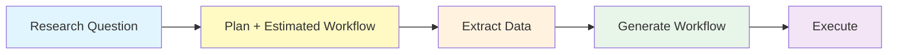

# Workflow Composer

Transform natural language research questions into executable HyperFlow workflows for the 1000 Genomes Project.

## Quick Start

```bash
pip install -e ".[all]"

# From natural language
g1kwf compose "Compare EUR vs AFR populations in the HLA region"

# From data files
g1kwf generate --data-csv data.csv --populations-dir data/populations -o workflow.json
```

## Pipeline Overview



| Phase | What happens |
|-------|--------------|
| **INTERPRET** | LLM parses research question → `ResearchIntent` |
| **PLAN** | Resolves data sources, estimates costs → advisory plan + estimated workflow |
| **EXTRACT** | Downloads/extracts VCF data via tabix → `data.csv` |
| **GENERATE** | Creates workflow from actual variant counts → `workflow.json` |
| **EXECUTE** | Runs workflow via HyperFlow → output archives |

## Installation

```bash
pip install -e .              # Basic
pip install -e ".[mcp]"       # + MCP server
pip install -e ".[llm]"       # + LLM interpretation
pip install -e ".[all]"       # Everything
```

## CLI Commands

```bash
g1kwf compose "research question"    # Natural language → workflow
g1kwf plan '{"analysis_type":...}'   # Structured intent → plan
g1kwf generate --data-csv ...        # Data files → workflow.json
g1kwf regions                        # List known genomic regions
g1kwf populations                    # List population codes
```

## MCP Server

For Claude Desktop integration:

```bash
# Run locally
python -m workflow_composer.mcp_server

# Or via Docker
docker run -i --rm hyperflowwms/1000genome-mcp:2.0
```

Add to `~/.config/Claude/claude_desktop_config.json`:
```json
{
  "mcpServers": {
    "1000genome": {
      "command": "docker",
      "args": ["run", "-i", "--rm", "hyperflowwms/1000genome-mcp:2.0"]
    }
  }
}
```

**Available tools:** `plan_workflow`, `generate_workflow`, `estimate_variants`, `list_known_regions`, `list_populations`

## Task Count Formula

For **C** chromosomes, **P** populations, **J** parallel jobs:

**Total tasks = C × (J + 2 + 2P)**

Example: 10 chromosomes, 7 populations, 250 jobs → 10 × (250 + 2 + 14) = **2,660 tasks**

## Architecture

```
src/workflow_composer/
├── core/                  # Business logic
│   ├── generator.py       # HyperFlow workflow generation
│   ├── planner.py         # Advisory plans + metadata
│   ├── models.py          # Pydantic contracts
│   └── data_resolver.py   # Data source resolution
├── interpretation/        # LLM layer
│   └── llm_interpreter.py # Research question → intent
├── mcp_server.py          # MCP interface
└── cli.py                 # CLI interface
```

## Testing

```bash
pytest tests/ -v
```

---

## Detailed Documentation

### Phase Details

<details>
<summary><strong>INTERPRET</strong> — Parse research question</summary>

The researcher asks a question like *"Do European and African populations show different mutation patterns in the HLA region?"*

The LLM extracts:
- **Populations**: EUR, AFR
- **Genomic scope**: HLA region (chr6:28477797-33448354)
- **Analysis type**: population_comparison
- **Variant focus**: all_variants

Output: `ResearchIntent` — a structured contract for downstream phases.
</details>

<details>
<summary><strong>PLAN</strong> — Estimate costs and generate preliminary workflow</summary>

Resolves the abstract request to concrete data sources:

- **Data commands**: Tabix extraction commands or download URLs
- **Transfer estimate**: How many MB will be downloaded
- **Estimated workflow**: Complete HyperFlow DAG based on estimated variant counts

This enables early review before committing to large downloads.
</details>

<details>
<summary><strong>EXTRACT</strong> — Acquire genomic data</summary>

Executes data preparation from the plan:

```bash
# Region extraction via tabix
tabix -h "https://ftp.1000genomes.ebi.ac.uk/.../ALL.chr6...vcf.gz" \
  6:28477797-33448354 > ALL.chr6.hla.vcf
```

Produces VCF files + `data.csv` manifest with actual variant counts.
</details>

<details>
<summary><strong>GENERATE</strong> — Create production workflow</summary>

Regenerates workflow with exact task boundaries from actual data:

```bash
# Count variants
VARIANTS=$(grep -v '^#' ALL.chr6.hla.vcf | wc -l)

# Create manifest
echo "ALL.chr6.hla.vcf,${VARIANTS},ALL.chr6.hla.annotation.vcf" > data.csv

# Generate
g1kwf generate --data-csv data.csv --populations-dir populations/ -o workflow.json
```

Task parallelism can be tuned based on cluster size (vCPUs).
</details>

<details>
<summary><strong>EXECUTE</strong> — Run via HyperFlow</summary>

Submit `workflow.json` to HyperFlow for execution on your compute infrastructure (Kubernetes, HPC cluster, or local Docker for testing).

**Workflow stages:**
1. `individuals` — Partition VCF, extract sample columns
2. `sifting` — Filter by SIFT deleteriousness scores
3. `mutation_overlap` — Count shared mutations per population
4. `frequency` — Calculate allele frequencies

**Outputs:** `chr{N}-{POP}.tar.gz`, `chr{N}-{POP}-freq.tar.gz`
</details>

### MCP Tools Reference

| Tool | Description |
|------|-------------|
| `plan_workflow` | Generate advisory plan from research parameters |
| `generate_workflow` | Generate HyperFlow JSON from chromosome data |
| `estimate_variants` | Estimate variant count for chromosome/region |
| `list_known_regions` | List genomic regions with coordinates |
| `list_populations` | List population codes with descriptions |

### MCP Resources (Skills)

| Resource | Description |
|----------|-------------|
| `SKILL.md` | Workflow planning guidelines |
| `populations.md` | Population codes |
| `genomic-regions.md` | Known regions |
| `data-sources.md` | Data URLs (AWS, GCP, FTP) |

## License

See repository LICENSE file.
