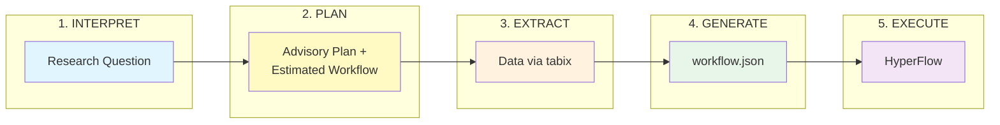

# Workflow Composer

Generate genomics workflow plans from natural language for the 1000 Genomes Project.

## Overview

The **workflow-composer** is an agent that transforms natural language research questions into executable workflow plans for scientific computing. It produces structured output suitable for human review and downstream execution agents.



→ [Detailed pipeline documentation](#end-to-end-pipeline)

## Key Features

- **Dual-mode operation**: MCP server (chat) + CLI (standalone)
- **Native workflow generation**: Direct HyperFlow JSON output 
- **Human-in-the-loop**: Plans returned for review before execution
- **Structured contracts**: Pydantic models for validation and documentation
- **Format export**: HyperFlow and WfCommons formats supported

## Installation

```bash
# Basic installation
pip install -e .

# With MCP server support
pip install -e ".[mcp]"

# With LLM interpretation support
pip install -e ".[llm]"

# Full installation
pip install -e ".[all]"
```

## Usage

### Direct Workflow Generation 

```bash
# Generate HyperFlow workflow directly
g1kwf generate \
    --data-csv ../workflow-generator/data.csv \
    --populations-dir ../workflow-generator/data/populations \
    --ind-jobs 250 \
    -o workflow.json
```

### Natural Language Interface

```bash
# Generate workflow from research question (requires LLM deps)
g1kwf compose "Compare EUR vs AFR in HLA region"
```

### Structured Intent

```bash
# Generate from structured JSON
g1kwf plan '{"analysis_type": "population_comparison", "populations": ["EUR", "AFR"]}'
```

### List Available Options

```bash
# List known genomic regions
g1kwf regions

# List population codes
g1kwf populations
```

## MCP Server

The workflow-composer includes an MCP (Model Context Protocol) server for integration with Claude Desktop and other MCP-compatible clients.

### Running Locally

```bash
python -m workflow_composer.mcp_server
```

### Docker Image

Build and run as a Docker container:

```bash
cd workflow-composer
make image
docker run -i --rm hyperflowwms/1000genome-mcp:2.0
```

### Claude Desktop Integration

Add to Claude Desktop configuration (`~/.config/Claude/claude_desktop_config.json`):

```json
{
  "mcpServers": {
    "1000genome": {
      "command": "docker",
      "args": ["run", "-i", "--rm", "hyperflowwms/1000genome-mcp:2.0"]
    }
  }
}
```

### MCP Tools

| Tool | Description |
|------|-------------|
| `plan_workflow` | Generate advisory workflow plan from research parameters |
| `generate_workflow` | Generate actual HyperFlow workflow JSON from chromosome data |
| `estimate_variants` | Estimate variant count for a chromosome or genomic region |
| `list_known_regions` | List available genomic regions with coordinates |
| `list_populations` | List population codes with descriptions |

### MCP Resources (Skills)

The server provides skill documents as MCP resources:

| Resource | Description |
|----------|-------------|
| SKILL.md | Workflow planning guidelines |
| populations.md | Population codes and descriptions |
| genomic-regions.md | Known genomic regions |
| data-sources.md | Data source URLs (AWS, GCP, FTP) |
| research-contexts.md | Scientific context mapping |

## Task Count Formula

For **C** chromosomes, **P** populations, **J** ind_jobs per chromosome:

| Task Type | Count |
|-----------|-------|
| individuals | C × J |
| individuals_merge | C × 1 |
| sifting | C × 1 |
| mutation_overlap | C × P |
| frequency | C × P |
| **TOTAL** | **C × (J + 2 + 2P)** |

Example: C=10, P=7, J=250 → 10 × (250 + 2 + 14) = **2660 tasks**

## Architecture

```
workflow-composer/
├── src/workflow_composer/
│   ├── core/                  # Business logic
│   │   ├── generator.py       # ★ Native HyperFlow generation
│   │   ├── models.py          # Pydantic models
│   │   ├── planner.py         # Wraps generator + metadata
│   │   ├── data_resolver.py   # Data source selection
│   │   └── export.py          # Format converters
│   ├── interpretation/        # LLM layer (CLI mode)
│   │   ├── skill_loader.py    # Load skills as context
│   │   └── llm_interpreter.py # Research question → intent
│   ├── mcp_server.py          # MCP server interface
│   └── cli.py                 # CLI interface
├── skills/                    # Domain knowledge documents
├── tests/                     # Test suite
└── pyproject.toml
```

## Testing

```bash
# Run all tests
pytest tests/ -v

# Run specific test file
pytest tests/test_generator.py -v
```


## Test Data vs Production Data

The workflow-composer generates two distinct outputs:

### 1. Workflow Structure (from test data)
The `workflow` field in the output uses `data.csv` which references **test data files** like `ALL.chr6.250000.vcf`. These are pre-processed files with exactly 250,000 rows each for workflow structure testing. The row counts are NOT genomic coordinates.

### 2. Data Preparation Plan (for production)
The `data_preparation` field describes how to obtain **real 1000 Genomes data** for production execution:

- **Full chromosome download**: For broad analyses, download complete VCF files
- **Tabix remote extraction**: For specific regions (e.g., HLA), use tabix to extract only relevant variants:
  ```
  tabix -h s3://1000genomes/.../ALL.chr6...vcf.gz 6:28477797-33448354 > chr6_hla.vcf.gz
  ```

When `use_remote_extraction: true`, the workflow should be run against the extracted VCF files rather than the test data. The data prep steps show the exact tabix commands/regions needed.

### Example Data Prep Output
```json
{
  "action": "extract_region",
  "source": "s3://1000genomes/release/20130502/ALL.chr6...vcf.gz",
  "region": "6:28477797-33448354",
  "output_file": "chr6_hla.vcf.gz"
}
```

## End-to-End Pipeline

The workflow-composer supports a 5-phase pipeline from research questions to executed workflows. See the [Overview](#overview) for the simple diagram.

### Detailed Data Flow


### Phase 1: INTERPRET

**Purpose**: Translate the scientist's research question into a machine-readable specification.

The researcher asks a question in natural language, like *"Do European and African populations show different deleterious mutation patterns in the HLA region?"* This phase uses an LLM (or a mock for testing) to extract:

- **Populations** to compare (EUR, AFR)
- **Genomic scope**: specific regions (HLA), chromosomes, or genome-wide
- **Analysis type**: population comparison, multi-population survey, region analysis
- **Variant focus**: all variants, deleterious only, etc.

The output is a `ResearchIntent` — a structured contract that downstream phases can process deterministically.

### Phase 2: PLAN

**Purpose**: Determine what data is needed, estimate computational costs, and generate the workflow structure — all *before* committing to data extraction or execution.

Given the ResearchIntent, this phase resolves the abstract request to concrete 1000 Genomes data sources and produces:

- **Data acquisition commands**: Exact tabix commands to extract regions from remote VCF files, or full-chromosome download URLs
- **Estimated data transfer**: How many megabytes will be downloaded
- **Estimated workflow** (`workflow-estimated.json`): A complete HyperFlow workflow with all tasks and dependencies, based on estimated variant counts from 1000 Genomes metadata

The estimated workflow enables:

- **Structural validation**: Verify the workflow DAG is correctly formed
- **Parallelism preview**: See exactly how many `individuals`, `sifting`, `mutation_overlap`, and `frequency` tasks will be created
- **Early review**: For large analyses, validate the approach before downloading gigabytes of data

### Phase 3: EXTRACT

**Purpose**: Acquire the actual genomic data from 1000 Genomes repositories.

Executes the data preparation steps from the PLAN phase:

- For **region-based analyses**: Uses `tabix` to extract specific genomic coordinates from remote VCF files (e.g., `tabix -h s3://1000genomes/.../ALL.chr6...vcf.gz 6:28477797-33448354`)
- For **chromosome-scale analyses**: Downloads complete VCF files
- Retrieves matching **annotation files** for SIFT scores

This phase produces the actual VCF files that will be processed, along with a `data.csv` manifest listing each file and its true row count.

**Example tabix extraction:**
```bash
# Extract only the HLA region from the remote VCF (requires SSL-enabled tabix)
tabix -h \
  "https://ftp.1000genomes.ebi.ac.uk/.../ALL.chr6...vcf.gz" \
  6:28477797-33448354 \
  > ALL.chr6.hla.vcf
```

**Required files after extraction:**
```
workflow-dir/
├── ALL.chr6.hla.vcf           # Extracted VCF (variants)
├── ALL.chr6.hla.annotation.vcf # Extracted annotations (for sifting)
├── columns.txt                 # Sample metadata (from data container)
├── AFR, ALL, AMR, EAS, EUR, GBR, SAS  # Population files
```

### Phase 4: GENERATE

**Purpose**: Create the production workflow using actual variant counts from the extracted data.

Now that we have real data, this phase regenerates the HyperFlow workflow with **exact** task boundaries. The difference from the estimated workflow in PLAN:

- **Accurate task partitioning**: `individuals` tasks split the data based on actual row counts, not estimates
- **Correct file references**: Tasks reference the actual extracted filenames
- **Cluster-aware parallelism**: The number of parallel tasks can be tuned based on available compute resources (vCPUs), balancing task granularity against scheduling overhead
- **Production-ready**: The output `workflow.json` is ready for execution

**Creating data.csv from extracted files:**
```bash
# Count variants (excluding header lines)
VARIANT_COUNT=$(grep -v '^#' ALL.chr6.hla.vcf | wc -l)
# Result: 2480

# Create data.csv mapping
echo "ALL.chr6.hla.vcf,${VARIANT_COUNT},ALL.chr6.hla.annotation.vcf" > data.csv
```

**Generate workflow:**
```bash
g1kwf generate \
    --data-csv data.csv \
    --populations-dir /path/to/populations/ \
    --parallelism small \
    --output workflow.json
```

The task count may differ slightly from estimates because chromosomal variant density varies, and the 20% safety margin in estimates is conservative.

### Phase 5: EXECUTE

**Purpose**: Run the workflow on the compute infrastructure.

Submits the generated `workflow.json` to HyperFlow for execution. The workflow processes variants through the 1000 Genomes pipeline:

1. **individuals**: Partition VCF by rows, extract sample columns
2. **sifting**: Filter variants by SIFT deleteriousness scores
3. **mutation_overlap**: Count shared mutations within each population
4. **frequency**: Calculate allele frequencies

**Run with Docker Compose:**
```bash
export WORKFLOW_DIR=/path/to/workflow-dir
export USER_ID=$(id -u)
export USER_GID=$(id -g)
export MAX_PARALLELISM=20

docker-compose up
```

Results are written to output archives (e.g., `chr6-EUR.tar.gz`, `chr6-EUR-freq.tar.gz`) containing the mutation overlap and frequency statistics that answer the original research question.

### Expected Outputs

| Output | Description |
|--------|-------------|
| `chr{N}n-*.tar.gz` | Per-task individual outputs |
| `chr{N}n.tar.gz` | Merged individuals result |
| `sifted.SIFT.chr{N}.txt` | Sifting output |
| `chr{N}-{POP}.tar.gz` | Mutation overlap per population |
| `chr{N}-{POP}-freq.tar.gz` | Frequency analysis per population |

### Example: Complete Agent Flow

```python
# Pseudocode for an execution agent

def execute_genomic_analysis(prompt: str):
    # Phase 1: INTERPRET - parse research intent
    intent = interpret_research_question(prompt)  # LLM call
    region = resolve_region(intent.region_name)   # HLA → chr6:28477797-33448354

    # Phase 2: PLAN - create advisory plan + estimated workflow
    plan = create_advisory_plan(intent)
    save_json(plan, "plan.json")
    estimated_workflow = generate_estimated_workflow(intent)
    save_json(estimated_workflow, "workflow-estimated.json")
    check_volume_thresholds(plan.estimated_transfer_mb)

    # Phase 3: EXTRACT - get data via tabix
    vcf_file = tabix_extract(
        url=get_vcf_url(region.chromosome),
        region=f"{region.chromosome}:{region.start}-{region.end}"
    )
    annotation_file = tabix_extract(
        url=get_annotation_url(region.chromosome),
        region=f"{region.chromosome}:{region.start}-{region.end}"
    )

    # Phase 4: GENERATE - create final workflow from actual data
    variant_count = count_variants(vcf_file)
    create_data_csv(vcf_file, variant_count, annotation_file)
    workflow = generate_workflow(
        data_csv="data.csv",
        populations_dir="/data/populations",
        parallelism="small"
    )

    # Phase 5: EXECUTE
    run_hyperflow(workflow)

    # Verify and return results
    return verify_outputs()
```

### Summary

| Phase | Input | Output | Key Decision |
|-------|-------|--------|--------------|
| **INTERPRET** | Natural language question | `ResearchIntent` | What does the scientist want to study? |
| **PLAN** | ResearchIntent | Advisory plan + `workflow-estimated.json` | What data is needed, how big, and is the structure correct? |
| **EXTRACT** | Plan | VCF files + `data.csv` | Acquire the actual genomic data |
| **GENERATE** | data.csv + cluster size | `workflow.json` | Build production workflow with real data |
| **EXECUTE** | workflow.json | Output archives | Run the analysis |


## License

See repository LICENSE file.
